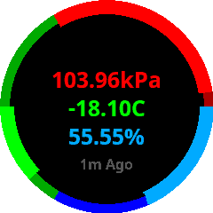

# Connect IQ ThingSpeak Weather Client

A simple widget that displays temperature, humidity, and air pressure from almost any ThingSpeak-enabled weather station on 240x240 round Garmin smartwatches (Vivoactive 3, Fenix 5, etc).

[Available for download on the Connect IQ store!](https://apps.garmin.com/en-US/apps/84b65b80-a8e5-46a5-a7d3-ab64123b4c03)

The target weather station must have channels for pressure (in pascals), humidity (%), and temperature (C). 
